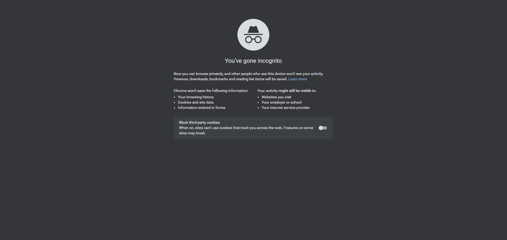

# weather_app
## https://weather-tanzeel.vercel.app/

## Functionality
The App, upon being loaded, prompts the user for their location, and if permission is granted, fetches the weather data for that location from the openweather API. This location is saved in local storage for subsequent visits.

![search] (./demo/search.gif)

Units can be switched back and forth between Celsius and Fahrenheit. Defaults to Celsius.

Project specification: https://www.theodinproject.com/paths/full-stack-javascript/courses/javascript/lessons/weather-app

## Technical

### Technologies Used:
JavaScript ES6, HTML, CSS, Webpack.